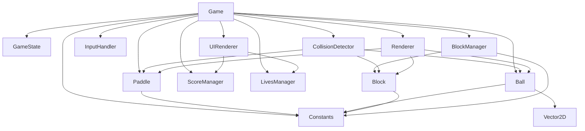

# ブロック崩しゲーム インターフェース定義書

## 1. モジュール一覧とその責務

### 1.1 ゲームコアモジュール

#### Game
- **責務**: ゲーム全体の制御、ゲームループの管理
- **ファイルパス**: `src/js/game.js`
- **エクスポート形式**: `export { Game }`

#### GameState
- **責務**: ゲームの状態管理（メニュー、プレイ中、ポーズ、ゲームオーバー等）
- **ファイルパス**: `src/js/gameState.js`
- **エクスポート形式**: `export { GameState }`

### 1.2 ゲームオブジェクトモジュール

#### Paddle
- **責務**: パドルの位置管理、移動制御、衝突判定
- **ファイルパス**: `src/js/paddle.js`
- **エクスポート形式**: `export { Paddle }`

#### Ball
- **責務**: ボールの位置と速度管理、物理演算、衝突判定
- **ファイルパス**: `src/js/ball.js`
- **エクスポート形式**: `export { Ball }`

#### Block
- **責務**: 個々のブロックの状態管理、破壊処理
- **ファイルパス**: `src/js/block.js`
- **エクスポート形式**: `export { Block }`

#### BlockManager
- **責務**: ブロックの生成、配置、全体管理
- **ファイルパス**: `src/js/blockManager.js`
- **エクスポート形式**: `export { BlockManager }`

### 1.3 システムモジュール

#### InputHandler
- **責務**: キーボード、マウス、タッチ入力の管理
- **ファイルパス**: `src/js/inputHandler.js`
- **エクスポート形式**: `export { InputHandler }`

#### CollisionDetector
- **責務**: 衝突判定の計算、反射角度の計算
- **ファイルパス**: `src/js/collisionDetector.js`
- **エクスポート形式**: `export { CollisionDetector }`

#### ScoreManager
- **責務**: スコアの管理、ハイスコアの保存/読み込み
- **ファイルパス**: `src/js/scoreManager.js`
- **エクスポート形式**: `export { ScoreManager }`

#### LivesManager
- **責務**: ライフの管理、ゲームオーバー判定
- **ファイルパス**: `src/js/livesManager.js`
- **エクスポート形式**: `export { LivesManager }`

### 1.4 レンダリングモジュール

#### Renderer
- **責務**: Canvas描画の管理、ゲームオブジェクトの描画
- **ファイルパス**: `src/js/renderer.js`
- **エクスポート形式**: `export { Renderer }`

#### UIRenderer
- **責務**: UI要素（スコア、ライフ、メニュー）の描画
- **ファイルパス**: `src/js/uiRenderer.js`
- **エクスポート形式**: `export { UIRenderer }`

### 1.5 ユーティリティモジュール

#### Constants
- **責務**: ゲーム全体で使用する定数の定義
- **ファイルパス**: `src/js/constants.js`
- **エクスポート形式**: `export { GAME_WIDTH, GAME_HEIGHT, PADDLE_WIDTH, PADDLE_HEIGHT, BALL_SIZE, BLOCK_WIDTH, BLOCK_HEIGHT, BLOCK_ROWS, BLOCK_COLS }`

#### Vector2D
- **責務**: 2Dベクトル演算のユーティリティ
- **ファイルパス**: `src/js/vector2d.js`
- **エクスポート形式**: `export { Vector2D }`

## 2. 各モジュールの公開メソッド

### 2.1 Game
```javascript
class Game {
    constructor(canvasId: string)
    start(): void                    // ゲームを開始
    pause(): void                    // ゲームを一時停止
    resume(): void                   // ゲームを再開
    reset(): void                    // ゲームをリセット
    update(deltaTime: number): void  // ゲームループの更新
    render(): void                   // ゲームの描画
}
```

### 2.2 GameState
```javascript
class GameState {
    constructor()
    setState(state: string): void    // 状態を変更
    getState(): string              // 現在の状態を取得
    isPlaying(): boolean            // プレイ中かどうか
    isPaused(): boolean             // ポーズ中かどうか
    isGameOver(): boolean           // ゲームオーバーかどうか
    isMenu(): boolean               // メニュー画面かどうか
}
```

### 2.3 Paddle
```javascript
class Paddle {
    constructor(x: number, y: number, width: number, height: number)
    reset(): void                    // 初期位置にリセット
    update(deltaTime: number): void  // 位置を更新
    moveLeft(): void                 // 左に移動
    moveRight(): void                // 右に移動
    stop(): void                     // 移動を停止
    setPosition(x: number): void     // 位置を直接設定
    getX(): number                   // X座標を取得
    getY(): number                   // Y座標を取得
    getWidth(): number               // 幅を取得
    getHeight(): number              // 高さを取得
    getBounds(): Object              // 衝突判定用の境界を取得
}
```

### 2.4 Ball
```javascript
class Ball {
    constructor(x: number, y: number, radius: number)
    reset(): void                    // 初期位置と速度にリセット
    update(deltaTime: number): void  // 位置を更新
    setVelocity(vx: number, vy: number): void  // 速度を設定
    reverseX(): void                 // X方向の速度を反転
    reverseY(): void                 // Y方向の速度を反転
    increaseSpeed(factor: number): void  // 速度を増加
    getX(): number                   // X座標を取得
    getY(): number                   // Y座標を取得
    getRadius(): number              // 半径を取得
    getVelocity(): Object            // 速度ベクトルを取得
    getBounds(): Object              // 衝突判定用の境界を取得
}
```

### 2.5 Block
```javascript
class Block {
    constructor(x: number, y: number, width: number, height: number, type: string)
    hit(): boolean                   // ブロックをヒット（破壊されたらtrue）
    isDestroyed(): boolean           // 破壊されているか
    getType(): string                // ブロックタイプを取得
    getScore(): number               // スコア値を取得
    getX(): number                   // X座標を取得
    getY(): number                   // Y座標を取得
    getWidth(): number               // 幅を取得
    getHeight(): number              // 高さを取得
    getBounds(): Object              // 衝突判定用の境界を取得
    getHitPoints(): number           // 残りヒットポイントを取得
}
```

### 2.6 BlockManager
```javascript
class BlockManager {
    constructor()
    reset(): void                    // ブロックを初期配置
    createLevel(level: number): void // レベルに応じたブロック配置
    getBlocks(): Array              // 全ブロックを取得
    getActiveBlocks(): Array        // 破壊されていないブロックを取得
    removeBlock(block: Block): void  // ブロックを削除
    isLevelComplete(): boolean       // レベルクリアかどうか
    getTotalBlocks(): number         // ブロック総数を取得
    getRemainingBlocks(): number     // 残りブロック数を取得
}
```

### 2.7 InputHandler
```javascript
class InputHandler {
    constructor()
    bindEvents(element: HTMLElement): void  // イベントをバインド
    unbindEvents(): void             // イベントをアンバインド
    isLeftPressed(): boolean         // 左キーが押されているか
    isRightPressed(): boolean        // 右キーが押されているか
    isSpacePressed(): boolean        // スペースキーが押されているか
    isPausePressed(): boolean        // ポーズキーが押されているか
    getMouseX(): number              // マウスのX座標を取得
    getTouchX(): number              // タッチのX座標を取得
}
```

### 2.8 CollisionDetector
```javascript
class CollisionDetector {
    constructor()
    checkBallPaddle(ball: Ball, paddle: Paddle): boolean  // ボールとパドルの衝突判定
    checkBallBlock(ball: Ball, block: Block): boolean     // ボールとブロックの衝突判定
    checkBallWalls(ball: Ball, gameWidth: number): string // ボールと壁の衝突判定（衝突した壁を返す）
    calculateReflectionAngle(ball: Ball, paddle: Paddle): Object  // パドルでの反射角度を計算
    getCollisionSide(ball: Ball, block: Block): string    // ブロックのどの面に衝突したか
}
```

### 2.9 ScoreManager
```javascript
class ScoreManager {
    constructor()
    reset(): void                    // スコアをリセット
    addScore(points: number): void   // スコアを加算
    getScore(): number               // 現在のスコアを取得
    getHighScore(): number           // ハイスコアを取得
    saveHighScore(): void            // ハイスコアを保存
    loadHighScore(): void            // ハイスコアを読み込み
    getCombo(): number               // 現在のコンボ数を取得
    incrementCombo(): void           // コンボを増加
    resetCombo(): void               // コンボをリセット
}
```

### 2.10 LivesManager
```javascript
class LivesManager {
    constructor(initialLives: number)
    reset(): void                    // ライフを初期値にリセット
    loseLife(): void                 // ライフを1つ減らす
    addLife(): void                  // ライフを1つ追加
    getLives(): number               // 現在のライフ数を取得
    isGameOver(): boolean            // ゲームオーバーかどうか
    getMaxLives(): number            // 最大ライフ数を取得
}
```

### 2.11 Renderer
```javascript
class Renderer {
    constructor(canvas: HTMLCanvasElement)
    clear(): void                    // 画面をクリア
    drawPaddle(paddle: Paddle): void // パドルを描画
    drawBall(ball: Ball): void       // ボールを描画
    drawBlock(block: Block): void    // ブロックを描画
    drawBackground(): void           // 背景を描画
    setContext(ctx: CanvasRenderingContext2D): void  // 描画コンテキストを設定
}
```

### 2.12 UIRenderer
```javascript
class UIRenderer {
    constructor(canvas: HTMLCanvasElement)
    drawScore(score: number, x: number, y: number): void      // スコアを描画
    drawLives(lives: number, x: number, y: number): void      // ライフを描画
    drawLevel(level: number, x: number, y: number): void      // レベルを描画
    drawGameOver(): void             // ゲームオーバー画面を描画
    drawPauseMenu(): void            // ポーズメニューを描画
    drawTitleScreen(): void          // タイトル画面を描画
    drawMessage(message: string, x: number, y: number): void  // メッセージを描画
}
```

### 2.13 Vector2D
```javascript
class Vector2D {
    constructor(x: number, y: number)
    add(vector: Vector2D): Vector2D      // ベクトルを加算
    subtract(vector: Vector2D): Vector2D // ベクトルを減算
    multiply(scalar: number): Vector2D   // スカラー倍
    normalize(): Vector2D                // 正規化
    magnitude(): number                  // 大きさを取得
    dot(vector: Vector2D): number        // 内積を計算
    getX(): number                       // X成分を取得
    getY(): number                       // Y成分を取得
    setX(x: number): void                // X成分を設定
    setY(y: number): void                // Y成分を設定
}
```

## 3. モジュール間の依存関係



### 依存関係の説明

1. **Game**: 中心的なモジュールで、他のすべてのモジュールを統合
2. **BlockManager**: Blockインスタンスを管理
3. **CollisionDetector**: ゲームオブジェクト間の衝突を検出
4. **Renderer/UIRenderer**: 描画専用モジュール
5. **Constants**: 全モジュールから参照される定数定義
6. **Vector2D**: Ballモジュールで速度計算に使用

## 4. エクスポート形式

すべてのモジュールは名前付きエクスポートを使用します：

```javascript
// 正しいエクスポート形式
export { ClassName };

// 正しいインポート形式
import { ClassName } from './module.js';
```

**重要**: `export default` は使用しません。

## 5. 共通の命名規則

### メソッド命名規則

1. **初期化**: `reset()` （`init()`は使用しない）
2. **更新処理**: `update(deltaTime)`
3. **値の取得**: `getValue()` （`getCurrentValue()`のような冗長な命名は避ける）
4. **状態判定**: `isState()` （例: `isGameOver()`, `isDestroyed()`）
5. **アクション**: 動詞で始める（例: `moveLeft()`, `addScore()`）

### プロパティ命名規則

1. **座標**: `x`, `y`
2. **サイズ**: `width`, `height`, `radius`
3. **速度**: `velocity`, `vx`, `vy`
4. **状態**: `state`, `type`
5. **カウンタ**: `score`, `lives`, `combo`

### 定数命名規則

1. **すべて大文字**: `GAME_WIDTH`, `PADDLE_SPEED`
2. **アンダースコアで単語を区切る**: `BLOCK_ROWS`, `BALL_INITIAL_SPEED`

### ファイル命名規則

1. **キャメルケース**: `gameState.js`, `blockManager.js`
2. **拡張子**: `.js` （TypeScriptの場合は `.ts`）

## 6. 実装上の注意事項

### パフォーマンス考慮事項

1. **オブジェクトプール**: 頻繁に生成/破棄されるオブジェクトに使用
2. **衝突判定の最適化**: 空間分割やバウンディングボックスの事前チェック
3. **描画の最適化**: 変更があった部分のみ再描画

### エラーハンドリング

1. **入力値の検証**: すべての公開メソッドで引数を検証
2. **境界チェック**: 配列アクセスや座標計算で境界チェック
3. **null/undefinedチェック**: オブジェクト参照前に確認

### テスタビリティ

1. **依存性注入**: コンストラクタで依存関係を注入
2. **純粋関数**: 可能な限り副作用のない関数を作成
3. **モック可能な設計**: インターフェースを明確に定義

## 7. 開発順序の推奨

1. **フェーズ1**: Constants, Vector2D
2. **フェーズ2**: GameState, InputHandler
3. **フェーズ3**: Paddle, Ball, Block
4. **フェーズ4**: BlockManager, CollisionDetector
5. **フェーズ5**: ScoreManager, LivesManager
6. **フェーズ6**: Renderer, UIRenderer
7. **フェーズ7**: Game（統合）

各フェーズでユニットテストを作成し、TDD（テスト駆動開発）を実践することを推奨します。