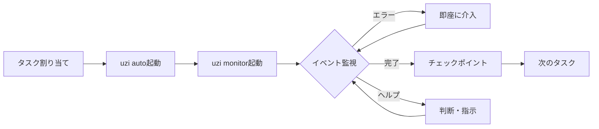

# uzi 設計思想ドキュメント

## 概要

uziシステムにおける各コマンドの役割分担と、効率的なマネージャーワークフローの設計思想を定義します。

## 基本設計思想

### コマンドの役割分担

#### `uzi ls -d` = 静的スナップショット
- **目的**: 現在の全体像を把握
- **用途**: 初回確認、定期的な全体確認
- **特徴**: ある時点での全エージェントの状態を表示

```bash
# 実行例
./uzi ls -d
NAME     STATUS    DURATION    TASK
ryan     ready     1h 25m      TodoList実装
joshua   working   45m         TodoForm実装
scott    idle      -           -
```

#### `uzi auto` = エージェント自動化
- **目的**: プロンプトへの自動応答
- **用途**: 信頼プロンプトや継続確認の自動化
- **特徴**: バックグラウンドで動作し、人的介入を削減

```bash
# 実行例
./uzi auto &  # バックグラウンドで自動Enter押下
```

#### `uzi monitor` = リアルタイム差分監視（新規提案）
- **目的**: 変更の監視と即時アラート
- **用途**: 作業中の継続的な監視と介入判断
- **特徴**: 状態変化やイベントをリアルタイムで通知

```bash
# 実行例
./uzi monitor
[10:23:45] ryan: STATUS working → ready
[10:23:46] ryan: FILE created src/ui/TodoList.js
[10:24:12] joshua: ERROR "Cannot find module FilterManager"
[10:25:01] manager: PROMPT joshua "FilterManagerのパスを確認して..."
[10:26:33] joshua: RESOLVED error fixed
[10:30:15] scott: STATUS idle → working
[10:30:16] scott: TASK "TodoStorage実装"
```

## マネージャーワークフロー

### 1. 基本的な作業フロー



### 2. 標準的な操作手順

```bash
# 1. 初期設定とタスク割り当て
./uzi prompt ryan "TodoList実装"
./uzi prompt joshua "TodoForm実装"
./uzi prompt scott "TodoStorage実装"

# 2. 自動化を開始
./uzi auto > /dev/null 2>&1 &  # バックグラウンドで自動応答

# 3. 監視開始（これ以降はこの画面を見続ける）
./uzi monitor

# 4. イベントに応じた対応
# エラー発生時
[ERROR] ryan: "ファイル競合"
→ ./uzi prompt ryan "既存ファイルを確認して..."

# ヘルプ要請時
[HELP] joshua: "インターフェース不明"
→ ./uzi prompt joshua "インターフェースは..."

# 完了通知時
[READY] scott: "タスク完了"
→ ./uzi checkpoint scott "feat: 実装完了"
```

## イベントカテゴリ仕様

### 通知タイプ一覧

| カテゴリ | 説明 | 対応優先度 | 対応例 |
|---------|------|-----------|--------|
| `[ERROR]` | エラー発生 | 🔴 高 | 即座に問題解決を支援 |
| `[HELP]` | 判断要請 | 🔴 高 | 方針や判断を提供 |
| `[READY]` | タスク完了 | 🟡 中 | チェックポイント実行 |
| `[WARNING]` | 警告（長時間無応答等） | 🟡 中 | 状況確認 |
| `[STATUS]` | ステータス変更 | 🟢 低 | 通常は対応不要 |
| `[FILE]` | ファイル操作 | 🟢 低 | 記録として確認 |
| `[PROGRESS]` | 進捗報告 | 🟢 低 | 進行状況の把握 |
| `[GIT]` | Git操作 | 🟢 低 | 必要に応じて確認 |
| `[TEST]` | テスト結果 | 🟡 中 | 失敗時は対応検討 |

### 通知フォーマット

```
[タイムスタンプ] エージェント名: カテゴリ - 詳細メッセージ
```

例：
```
[10:24:12] joshua: [ERROR] - "Cannot find module FilterManager"
[10:30:15] scott: [STATUS] - changed idle → working
[10:45:23] ryan: [READY] - "TodoList implementation completed"
```

## 高度な使用方法

### フィルタリング機能（将来実装）

```bash
# エラーとヘルプだけ表示
./uzi monitor --filter=error,help

# 特定エージェントだけ監視
./uzi monitor --agent=ryan,joshua

# 重要度でフィルタ
./uzi monitor --priority=high

# 詳細度の調整
./uzi monitor --verbose     # 全ての変更を表示
./uzi monitor --normal      # 重要な変更のみ（デフォルト）
./uzi monitor --quiet       # エラーと完了のみ
```

### 統合機能（将来実装）

```bash
# 自動対応の設定
./uzi monitor --auto-checkpoint  # 完了時に自動でチェックポイント
./uzi monitor --auto-dismiss     # エラー継続時に自動解雇

# 通知連携
./uzi monitor --notify=slack     # Slackに通知
./uzi monitor --sound=on         # 音声通知

# uzi autoとの連携
./uzi monitor --with-auto    # uzi autoも同時に起動
```

## アンチパターン

### ❌ してはいけないこと

1. **uzi monitorを起動せずに長時間放置**
   - エラーや問題を見逃す可能性大

2. **定期的にuzi ls -dを実行**
   - uzi monitorで十分、無駄な確認作業

3. **エラー通知を無視**
   - エージェントがブロックされ作業停止

4. **uzi autoを起動し忘れる**
   - プロンプトで作業が止まる

5. **複数ターミナルでuzi monitor実行**
   - 重複した監視で混乱

### ✅ 推奨される使い方

1. **作業開始時の標準手順**
   ```bash
   ./uzi auto > /dev/null 2>&1 &  # 自動化
   ./uzi monitor                   # 監視
   ```

2. **エラーは即座に対応**
   - エージェントの待ち時間を最小化

3. **定期的な健全性確認**
   - WARNING通知にも注意を払う

4. **ログの保存**
   - `./uzi monitor | tee uzi-monitor-$(date +%Y%m%d).log`

## 現在の実装状況と今後

### 実装済み機能
- `uzi ls -d`: 基本的な一覧表示
- `uzi ls -d -w`: watchモード（不安定）
- `uzi auto`: プロンプト自動応答

### 未実装機能（要望）
- `uzi monitor`: リアルタイム差分監視
- イベントカテゴリシステム
- フィルタリング機能
- 自動対応機能
- 通知連携

### 暫定的な代替手段

uzi monitorが実装されるまでは、以下のスクリプトで簡易的に実現可能：

```bash
#!/bin/bash
# simple-uzi-monitor.sh
# uzi monitorの簡易実装

LAST_STATE="/tmp/uzi-last-state"
touch $LAST_STATE

echo "Monitoring agents..."
echo "===================="

while true; do
    # 現在の状態を取得
    ./uzi ls -d > /tmp/uzi-current-state
    
    # 差分をチェック
    diff $LAST_STATE /tmp/uzi-current-state | grep "^>" | while read line; do
        echo "[$(date +%H:%M:%S)] STATUS: $line"
    done
    
    # エラーログをチェック（例）
    find . -name "*.error.log" -newer $LAST_STATE 2>/dev/null | while read file; do
        echo "[$(date +%H:%M:%S)] ERROR: New error in $file"
        echo "    ⚠️  Immediate attention required!"
    done
    
    # 完了ファイルをチェック
    find . -name ".uzi-task-completed*" -newer $LAST_STATE 2>/dev/null | while read file; do
        agent=$(echo $file | sed 's/.*completed-\(.*\)-parallelDevs.*/\1/')
        echo "[$(date +%H:%M:%S)] READY: $agent completed task"
        echo "    ✅ Ready for checkpoint!"
    done
    
    cp /tmp/uzi-current-state $LAST_STATE
    sleep 5
done
```

## 関連設計書

- [CLAUDE.mdハンドリング設計](./uzi-claude-md-handling.md) - worktreeでのCLAUDE.md管理方法

## まとめ

### コマンド体系の整理

| コマンド | 役割 | 使用タイミング |
|----------|------|----------------|
| `uzi ls -d` | 全体状況の把握 | 初回確認、定期確認 |
| `uzi auto` | プロンプト自動化 | 作業開始時（バックグラウンド） |
| `uzi monitor` | リアルタイム監視 | 作業中ずっと（フォアグラウンド） |

### 理想的なワークフロー

```bash
# 作業開始
./uzi auto > /dev/null 2>&1 &  # 自動化を開始
./uzi monitor                   # 監視を開始

# 作業中はuzi monitorの画面を見続ける
# エラーや完了通知に即座に対応

# 作業終了
pkill -f "uzi auto"            # 自動化を停止
```

この設計により、マネージャーは：

1. **効率的な監視** - 差分だけに集中（uzi monitor）
2. **自動化** - 単純作業から解放（uzi auto）
3. **迅速な対応** - 問題を即座に検知・対応
4. **役割の明確化** - 各コマンドの責任が明確

を実現し、複数エージェントの並列作業を効果的に管理できます。